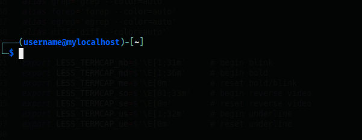

#### KALI-LIKE Theme for Oh-My-Zsh 

Kali-Like is a [oh-my-zsh](https://ohmyz.sh/) theme that looks like Kali Linux default zsh theme.
Kali-Like can be installed on any linux distribution and isn't Kali Linux dependent.

## Installation  

1. `wget -O ~/.oh-my-zsh/themes/kali-like.zsh-theme https://raw.githubusercontent.com/clamy54/kali-like-zsh-theme/master/kali-like.zsh-theme`  
2. `vim ~/.zshrc`  
3. Set `ZSH_THEME="current_theme"` to `ZSH_THEME="kali-like"`  

## Options

All options are defined at the top of the theme file.

### Plugins

Kali-Like uses `zsh-autosuggestions` and `zsh-syntax-highlighting` plugins.
If they are not found, they are downloaded automatically into `~/.zsh/`.

| Variable | Default | Description |
|---|---|---|
| `USE_SYNTAX_HIGHLIGHTING` | `yes` | Enable zsh-syntax-highlighting |
| `AUTO_DOWNLOAD_SYNTAX_HIGHLIGHTING_PLUGIN` | `yes` | Auto-download if not found |
| `USE_ZSH_AUTOSUGGESTIONS` | `yes` | Enable zsh-autosuggestions |
| `AUTO_DOWNLOAD_ZSH_AUTOSUGGESTIONS_PLUGIN` | `yes` | Auto-download if not found |

### Prompt layout

| Variable | Default | Description |
|---|---|---|
| `PROMPT_ALTERNATIVE` | `twoline` | `twoline` or `oneline`. Toggle at runtime with `Ctrl+P` |
| `NEWLINE_BEFORE_PROMPT` | `yes` | Print a blank line before each prompt |

### Colors

Colors are specified as 256-color palette indices. Run `spectrum_ls` in your terminal to browse all available colors.
Color names (`white`, `cyan`, `yellow`, etc.) are also accepted where noted.

| Variable | Default | Description |
|---|---|---|
| `FGPROMPT_USER` | `027` | `user@host` color (normal user) |
| `FGPROMPT_ROOT` | `196` | `root@host` color |
| `FRAMEPROMPT_USER` | `073` | Frame characters color (`┌`, `└─`, brackets) for normal user |
| `FRAMEPROMPT_ROOT` | `027` | Frame characters color for root |
| `GITPROMPT_COLOR` | `067` | Git branch color |
| `VENVPROMPT_COLOR` | `white` | Virtual environment name color (color name or index) |
| `PATHPROMPT_COLOR` | `terminal_default` | Path color — use `terminal_default` for the terminal's default foreground color, or any color name/index |

## Font  
By default, Kali Linux uses FiraCode as default terminal font.
You can [install](https://github.com/tonsky/FiraCode/wiki/Installing) it on your distro for a better Kali Look'n'Feel ...

## License
MIT [Cyril Lamy](https://github.com/clamy54)